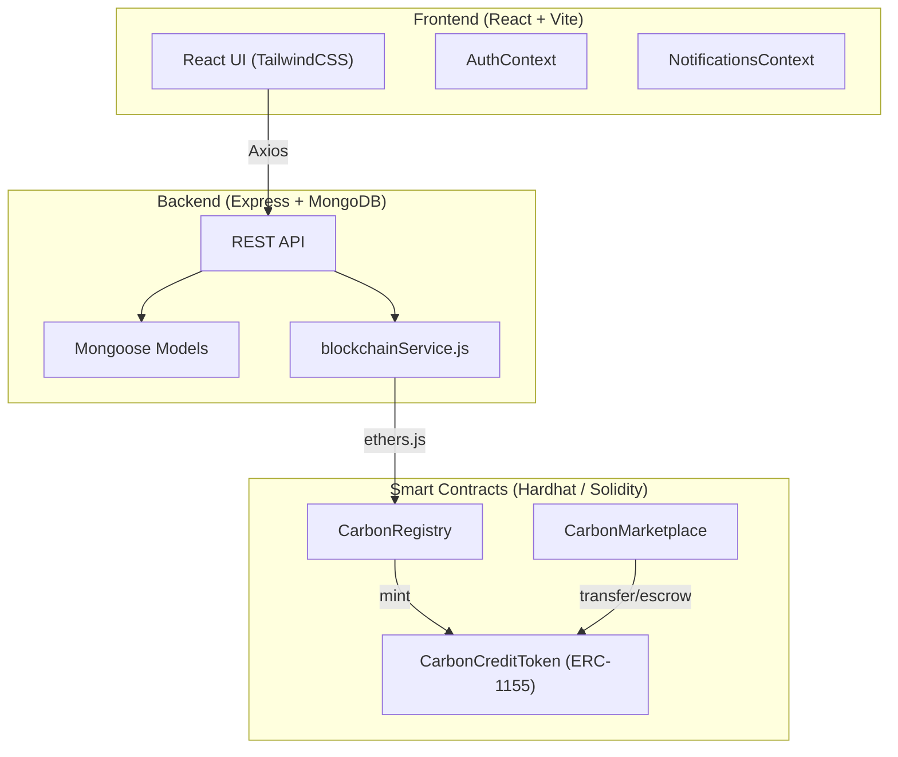
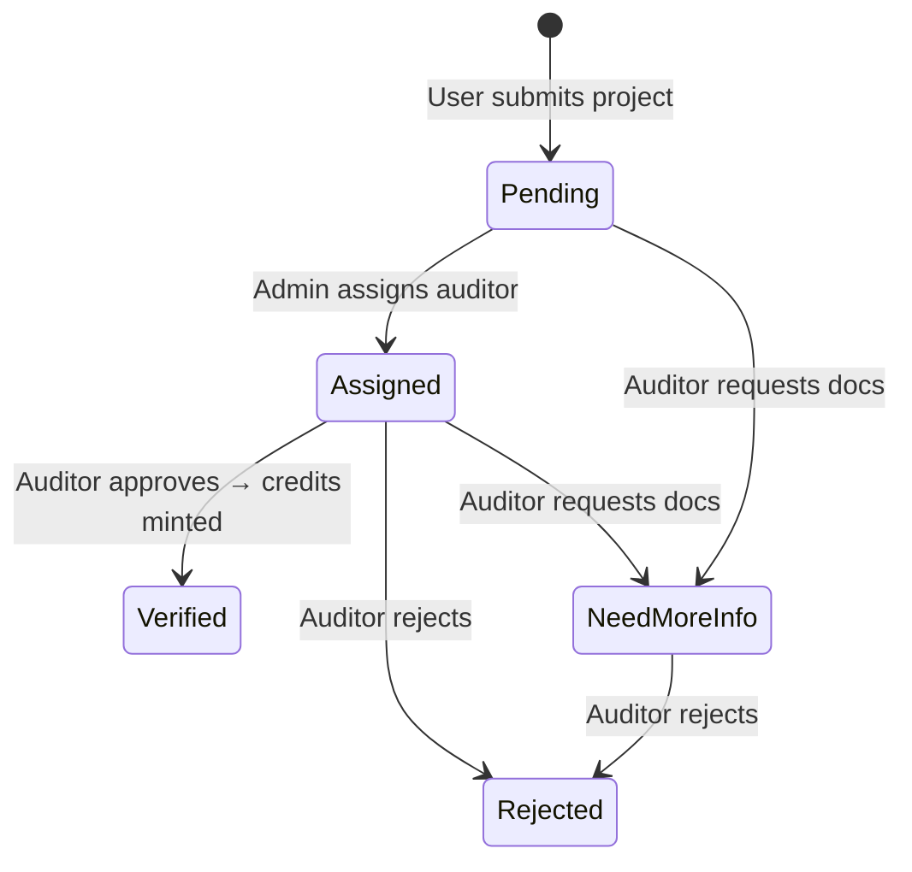
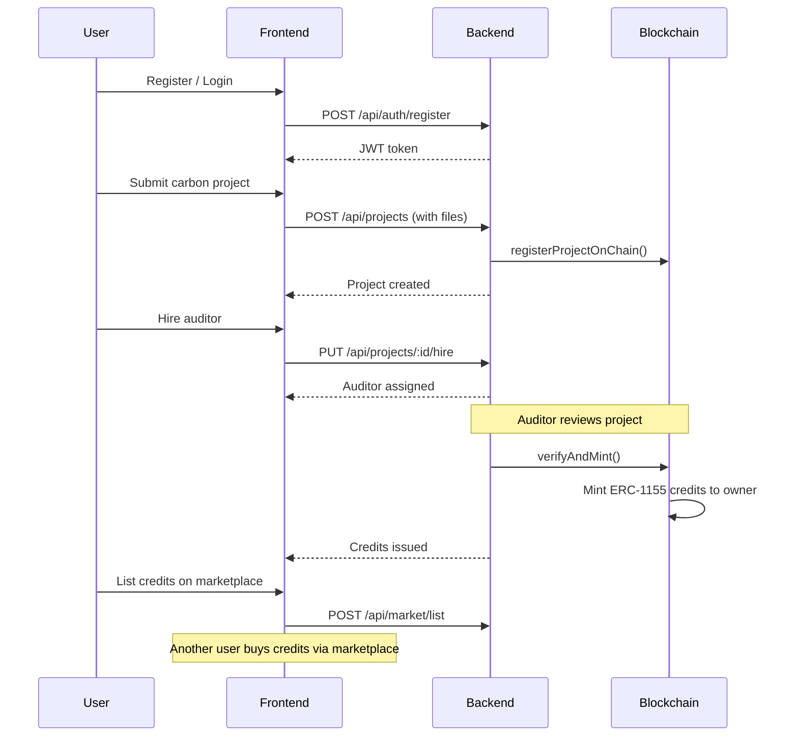

# ZEROMINT — Blockchain Carbon Credit Platform

## What Is This Project?

**ZEROMINT** is a full-stack, blockchain-powered **carbon credit marketplace**. It allows organizations to submit carbon-reduction projects (solar, wind, forestry, etc.), get them audited and verified, receive tokenized carbon credits on-chain (as ERC-1155 NFTs), and then trade those credits on a built-in marketplace.

> [!NOTE]
> The project name `carbon-ledger-full-notifications` (from the frontend `package.json`) and the repo name `ZEROMINT` both refer to the same application.

---

## Architecture Overview

The project has **3 layers**:

| Layer | Directory | Tech Stack |
|-------|-----------|------------|
| **Smart Contracts** | [contract/](file:///d:/project/zero/contract) | Solidity 0.8.20, Hardhat, OpenZeppelin, ethers v5 |
| **Backend API** | [Backend/](file:///d:/project/zero/Backend) | Node.js, Express 5, MongoDB (Mongoose), ethers v6, JWT auth |
| **Frontend** | [frontend/](file:///d:/project/zero/frontend) | React 18, Vite, TailwindCSS, Framer Motion, React Router 6 |

---

## Smart Contracts (On-Chain Layer)

Three Solidity contracts in [contract/contracts/](file:///d:/project/zero/contract/contracts):

### 1. [CarbonCreditToken.sol](file:///d:/project/zero/contract/contracts/CarbonCreditToken.sol) — The Token
- **ERC-1155** multi-token contract (each `tokenId` = one project's credits)
- Role-based access: only accounts with `MINTER_ROLE` can mint
- Supports **burning** (retiring credits to claim carbon offset)
- Uses OpenZeppelin's `AccessControl`

### 2. [CarbonRegistry.sol](file:///d:/project/zero/contract/contracts/CarbonRegistry.sol) — Project Lifecycle
Manages the full verification pipeline on-chain:

Key functions:
- `submitProject()` — User registers a carbon project
- `assignAuditor()` — Admin assigns a verified auditor (role-gated)
- `verifyProject()` — Auditor approves → **automatically mints** ERC-1155 credits to owner
- `rejectProject()` / `requestMoreInfo()` — Auditor feedback loop

### 3. [CarbonMarketplace.sol](file:///d:/project/zero/contract/contracts/CarbonMarketplace.sol) — Trading
- Sellers list credits for sale (tokens escrowed in contract)
- Buyers purchase with ETH
- **2% platform fee** (configurable up to 10%)
- Reentrancy-protected with OpenZeppelin's `ReentrancyGuard`

---

## Backend API

Express server in [Backend/src/app.js](file:///d:/project/zero/Backend/src/app.js) with 4 route groups:

| Route | Purpose | Key Operations |
|-------|---------|----------------|
| `/api/auth` | Authentication | Register, login (JWT + bcrypt) |
| `/api/projects` | Project management | Create project, hire auditor, list projects |
| `/api/audit` | Auditor workflow | View assigned projects, approve/reject |
| `/api/market` | Marketplace | List credits, buy credits |

### Data Models ([Backend/src/models/](file:///d:/project/zero/Backend/src/models))

| Model | Purpose |
|-------|---------|
| [User.js](file:///d:/project/zero/Backend/src/models/User.js) | Users with roles: `user`, `auditor`, `admin` + wallet address |
| [Project.js](file:///d:/project/zero/Backend/src/models/Project.js) | Carbon projects with files, status tracking, chain hash |
| [Credit.js](file:///d:/project/zero/Backend/src/models/Credit.js) | Issued carbon credits linked to projects |
| [Listing.js](file:///d:/project/zero/Backend/src/models/Listing.js) | Marketplace listings for credit trading |

### Blockchain Integration
[blockchainService.js](file:///d:/project/zero/Backend/src/services/blockchainService.js) bridges the backend to the smart contracts using ethers.js:
- `registerProjectOnChain()` — Called when a project is created
- `verifyAndMint()` — Called when an auditor approves → triggers on-chain verification + token minting

---

## Frontend

React SPA built with Vite + TailwindCSS, using Framer Motion for animations.

### Two Portals

**User Portal** (wrapped in [Shell.jsx](file:///d:/project/zero/frontend/src/layouts/Shell.jsx)):

| Page | Purpose |
|------|---------|
| [Dashboard.jsx](file:///d:/project/zero/frontend/src/pages/Dashboard.jsx) | Overview / landing |
| [AddProject.jsx](file:///d:/project/zero/frontend/src/pages/AddProject.jsx) | Submit a new carbon project with file uploads |
| [MyProjects.jsx](file:///d:/project/zero/frontend/src/pages/MyProjects.jsx) | Track submitted projects and their status |
| [HireAuditor.jsx](file:///d:/project/zero/frontend/src/pages/HireAuditor.jsx) | Assign an auditor to a project |
| [Marketplace.jsx](file:///d:/project/zero/frontend/src/pages/Marketplace.jsx) | Browse and buy carbon credits |

**Auditor Portal** (wrapped in [AuditorShell.jsx](file:///d:/project/zero/frontend/src/layouts/AuditorShell.jsx), protected by [RequireAuditor](file:///d:/project/zero/frontend/src/routes/Protected.jsx)):

| Page | Purpose |
|------|---------|
| [auditor/Dashboard.jsx](file:///d:/project/zero/frontend/src/pages/auditor/Dashboard.jsx) | Auditor overview |
| [auditor/Clients.jsx](file:///d:/project/zero/frontend/src/pages/auditor/Clients.jsx) | View assigned projects to review |
| [auditor/Marketplace.jsx](file:///d:/project/zero/frontend/src/pages/auditor/Marketplace.jsx) | Auditor's marketplace view |

### State Management
- [AuthContext.jsx](file:///d:/project/zero/frontend/src/context/AuthContext.jsx) — JWT token storage, user role, login/logout
- [NotificationsContext.jsx](file:///d:/project/zero/frontend/src/context/NotificationsContext.jsx) — In-app notification system

---

## End-to-End Flow

---

## Key Technical Details

| Aspect | Detail |
|--------|--------|
| **Token standard** | ERC-1155 (multi-token — one token ID per project) |
| **Auth** | JWT + bcrypt password hashing |
| **File uploads** | Multer (multipart form data) |
| **Blockchain network** | Hardhat local (chainId 31337) / localhost:8545 |
| **Deployment** | [deploy.js](file:///d:/project/zero/contract/scripts/deploy.js) deploys all 3 contracts and grants `MINTER_ROLE` to Registry |
| **Fee model** | 2% marketplace fee (configurable, max 10%) |

> [!IMPORTANT]
> The backend's `blockchainService.js` uses **ethers v6** syntax (`JsonRpcProvider`), while the Hardhat deploy script uses **ethers v5** syntax (`deployed()`, `utils.keccak256`). These are separate environments and not a conflict — the backend connects to an already-deployed contract.
